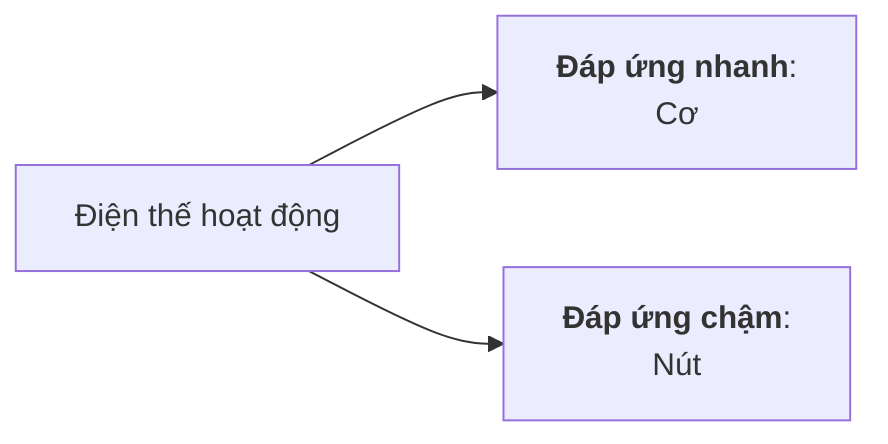
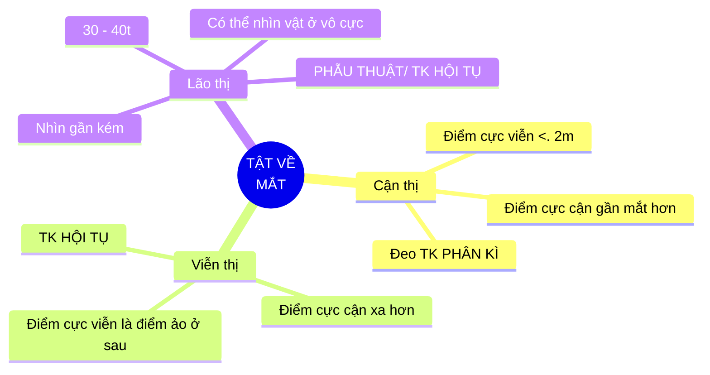

## Mục tiêu

### CL01

Vận dụng các kiến thức về cơ học để giải thích được:

* Chuyển động của chất điểm, vật rắn và của cơ thể sống.
* Quá trình lan truyền và tác động của sóng âm trong cơ thể.
* Quá trình vận chuyển máu trong hệ tuần hoàn.

### CL02

Vận dụng các nguyên lý nhiệt động lực học để giải thích:

* Quá trình trao đổi khí ở phổi.
* Hiện tượng thuyên tắc mạch do bọt khí.
* Quá trình và chiều chuyển biến năng lượng trong cơ thể.

### CL03

* Giải thích được các hiện tượng điện sinh vật và trình bày
  cơ chế phát sinh và dẫn truyền điện thế màng tế bào.
* Trình bày các tác động của dòng điện lên cơ thể sống.

### CL04

Vận dụng các quy luật tương tác giữa ánh sáng và môi
trường để giải thích được:

* Nguyên lý tạo ảnh ở mắt và các hiệu ứng sinh học của
  ánh sáng lên cơ thể.
* Nguyên tắc sử dụng tia Laser, máy quang phổ trong y học.

### CL05

Vận dụng các kiến thức về phóng xạ sinh học và vật lý
hạt nhân để giải thích được:

* Các đại lượng, đơn vị đo lường trong phóng xạ hạt nhân.
* Bản chất tia X và Khái niệm an toàn phóng xạ.
* Cơ chế tác dụng, hiệu ứng sinh học của bức xạ hạt nhân.

### CL06

Sử dụng thiết bị đo ghi phóng xạ để đo độ hấp thu, quãng
đường đi của tia phóng xạ.

### CL07

Sử dụng thiết bị siêu âm Doppler để đo vận tốc của siêu
âm trong không khí và vận tốc của vật chuyển động
thẳng đều.

## Chương 1: Chuyển động cơ học

Trọng tâm:

### Chuyển động, tính chất và quỹ đạo của các chuyển động

| Thẳng, biến đổi đều                    | Tròn, biến đổi đều                                    |
|:--------------------------------------:|:-----------------------------------------------------:|
| $ v = v_0 + at $                       | $ \omega = \omega_0 + \alpha t $                      |
| $ \Delta x = v_0 t + \frac{1}{2} at^2$ | $ \Delta \phi = \omega_0 t + \frac{1}{2} \alpha t^2 $ |

<!--  -->

### Các ĐL Newton

ĐL 1: Nếu một vật **không chịu tác dụng của lực** nào hoặc chịu tác dụng của các lực có hợp lực bằng không, thì nó **giữ nguyên trạng thái** đứng yên hoặc chuyển động thẳng đều

ĐL 2: Véctơ gia tốc của một vật **luôn cùng hướng với lực** tác dụng lên vật. Độ lớn của véctơ gia tốc **tỉ lệ thuận** với **độ lớn của véctơ lực** tác dụng lên vật và **tỉ lệ nghịch** với **khối lượng của vật**.

ĐL 3: Khi vật A tác dụng lên vật B một lực, thì vật B cũng tác dụng trở lại vật A một lực. Hai lực này là hai lực trực đối.

### Momen lực và các bài tập xoay quanh

Momen lực là đại lượng vector đặc trưng cho tác dụng cơ học làm quay vật

* Có phương: Song song trục quay

* Có chiều:  Quy tắc nắm tay phải

* Độ lớn $ M = Fd $ (d: cánh tay đòn)

Hai điều kiện để vật rắn ở trạng thái cân bằng tĩnh:

* Cân bằng tịnh tiến: Tổng hợp lực tác dụng lên vật rắn phải bằng không.
* Cân bằng quay: tổng các momen lực có xu hướng làm vật quay theo chiều kim đồng hồ phải bằng tổng các momen lực có xu hướng làm vật quay theo chiều ngược lại.

### Đòn bẩy

Đòn bẩy loại 1:

Đòn bẩy loại 2:

Đòn bẩy loại 3:

### Năng lượng và công

Công (A) là một đại lượng vô hướng

$A = F . s . cos(\theta)$

<!-- Nếu phương của lực và độ dời tạo với nhau một góc $    \theta$ thì
$ 𝐹_𝑠  = 𝐹 . cos(\theta). $ -->

Đơn vị công trong hệ đơn vị S.I là Joule (J).
1J = 1 N.m

* Động năng $ K = \frac{1}2 mv^2$

  <!-- * $ Động năng K = \frac{1}2 mv^2$ -->

* Thế năng $ U = mgh $

Năng lượng cơ trong cơ thể:

* Động năng tịnh tiến và quay

* Thế năng trọng trường và đàn hồi

### CLS: Cơ chế gãy xương

## Chương 2: Sóng cơ - Sóng âm & Siêu âm

<!-- ### Dao động và tính chất -->

### Dao động điều hoà

$ x = Acos( \omega t + \varphi )$

A là biên độ dao động:
$ A = \frac{L}2 = \frac{S}4 $

L là chiều dãi quỹ đạo của dao động

S là quãng đường trong 1 chu kỳ

$ \omega = 2 \pi f = \frac{2 \pi}T$

$ v_{max} = \omega A$

Vận tốc bằng không khi ở vị trí biên

Vận tốc sẽ đổi chiều tại biên đồ và nhanh hơn pha li độ một góc $ \frac{\pi}2$

$ a = v' = x'' = - \omega ^2x $

Gia tốc ngược pha với li độ và sớm pha hơn vận tốc một góc $ \frac{\pi}2$

### Sóng cơ

* “Sóng ngang: phương dao động vuông góc với phương truyền sóng”, không xuất hiện trong chất lỏng và chất khí.

* “Sóng dọc” xuất hiện khi có “sự giãn nén” của các phần tử vật chất trong một môi trường nhất định.

* Sóng mặt: là loại sóng chỉ truyền trong lớp mỏng của không gian (hầu như trong không gian 2D)

* Nhiễu xạ là hiện tượng sóng đi qua khe hẹp hoặc khi gặp vật cản thì nó bị lệch khỏi phương truyền thẳng và đi vòng qua vật cản

### Sóng âm

### Ngườn phát và máy thu Doppler

### Chẩn đoán nghe và gõ

### Ứng dụng

## Chương 3: Cơ học chất lưu

### Tĩnh học chất lưu

* PT thuỷ tĩnh:

  $p = p_o + \rho gh$

* Siphon:

  $p_c = p_0 + \rho gh$

* Định luật Pascal:

  $ p = p_{ng} + \rho gh$

* Hiện tượng mao dẫn: chỉ có vật nằm trên bề mặt

  $ p_i = \frac{a}{V_\mu^2}$

* Năng lượng mặt ngoài của chất lỏng

  $ W =  \sigma S$

  Thế năng cực tiểu => xu hướng giảm

* Lực căng mặt ngoài của chất lỏng:

  $ F = \sigma l$

* Góc làm ướt:

  $ \theta < 90^o$: làm ướt thành bình

  $ \theta > 90^o$: không làm ướt thành bình

* Áp suất phụ ($ \Delta p$): Áp suất phụ cùng chiếu với áp suất phân tử $\Leftrightarrow \Delta p > 0$:

  $ \Delta p = \sigma (\frac{1}{R_1} + \frac{1}{R_2}) $

  Mặt chất lỏng dạng hình cầu:

  $ \Delta p = \frac{2\sigma}R$

  Mặt chất lỏng dạng hình trụ

  $ \Delta p = \frac{\sigma}R$

  Công thức Jurin

  $ h = \frac{2\sigma cos\theta}{r\rho g}$

  

* Ống đếm giọt: $ P = F $

### Định luật Pascal, Laplace, áp suất thuỷ tĩnh, lực đẩy Archimedes. lực căng  mặt ngoài

### Phương trình liên tục, Bernoulli, Poiseuill

### Dòng chảy của máu

### CLS DẪN LƯU MÀNG DỊCH PHỔI

Van Heimlich:

* Thở ra áp suất khoang màng phổi lớn nên áp suất động nhỏ, vận tốc nhỏ, tiết diện của ống lớn, khí dịch khg màng phổi đẩy ra ngoài

* Khi hít vào Áp suát tĩnh dọc theo van giảm, vận tốc tăng, tiết diện giảm, làm ống khép lại nhanh, ngăn khí từ bên ngoài vào
  Dẫn lưu dịch bằng penrose (áp suất phụ, chiều dài nhỏ, R cũng nhỏ)

  Hê thống bình:

* Bán kính càng lớn thì áp suất phụ càng nhỏ, ống dẫn lưu dịch từ cơ thể ra ng

* Sự đóng góp của áp suất phụ trong ống penrose bị bỏ qua (áp suất phụ, chiều dài nhỏ, R cũng nhỏ), chủ yếu là nhờ trọng lực (chiều cao của dòng chất lỏng) chảy từ trên xuống

| Hệ thống 1 bình                                                 | Hệ thống 2 bình                |
|:---------------------------------------------------------------:|:------------------------------:|
| Cột chất lỏng thay đổi hiệu quả dẫn lưu, nguy cơ hút ngược dịch | Hiệu quả cao, không có nguy cơ |
| Đơn giản, thay bình thường xuyên                                | Phức tạp, ít thay bình         |

## Chương 4: Thuyết động học Phân Tử

### PT khí lí tưởng

$pV = nRT $

* ĐL Boyle: $pV = const$

* ĐL Gay: $\frac{V}T=const$

* ĐL Charles: $\frac{p}T = const$

### Định luật Fick, Henry, PT thẩm thấu áp suất

Định luật Fick: Lượng chất khuếch tán qua màng

$\Delta M=-D\frac{d \rho}{dx} \Delta S.\Delta t$

Định luật Henry: Lượng khí khuếch tán vào chất lỏng tỉ lệ thuận với áp suất riêng phần của chất khí đó trên bề mặt chất lỏng

$ V = D \frac{p_n}p$

PT ASTT:

$p = nC_MRT$

### CLS: RỐI LOẠN TRAO ĐỔI KHÍ TRONG BỆNH LÝ TẠI PHỔI

$P_AO2 = FiO2(P_0 - P_{H_2O}) \ – \ P_ACO2/k$

Với P0 = áp suất khí quyển=760mmHg, PH2O = 47mmHg

PACO2=37mmHg; k=0,8

Ở điều kiện hít khí trời, FiO2=21% thì PAO2 = 103,48

$P_AO_2/P_aO_2=P’_AO_2/P’_aO_2$

Tăng PaO2 từ 50 lên 60mmHg nên tính ra được P’AO2=124,136 → FiO2 khi thở Canula tối thiểu là 23,90%.

*Mỗi tăng 4% FiO2 ta cần 1 lít O2/phút.*

## Chương 5: Nhiệt động lực học

### Nguyên lý thứ nhất

Công:

$A=-p(V_1-V_2)$

Độ biến thiên nội năng (năng lượng) của một hệ trong một quá trình biến đổi bằng tổng công và nhiệt lượng mà hệ nhận vào trong quá trình đó.

Quá trình hữu hạn: $\Delta U = A + Q$

Động cơ vĩnh cửu loại 1: Một động cơ có khả năng sinh ra công mà không cần nhận
năng lượng ở đầu vào là động cơ vĩnh cửu loại một

$\Rightarrow$ Cơ thể muốn hoạt động thì cần nhận năng lượng từ bên ngoài. Công cơ thể gồm: công hoá học, cơ học, thẩm thấu, điện

* Nhiệt sơ cấp (Nhiệt cơ bản): quá trình trao đổi chất, tỷ lệ thuận với cường độ trao đổi chất và tỷ lệ nghịch với hiệu suất của chúng.

* Nhiệt thứ cấp (Nhiệt hoạt động): quá trình sinh công khác nhau, tỷ lệ với hoạt tính của mô, hoạt động của cơ.

Nguyên lý thứ nhất nói lên sự tương đương về số lượng giữa nhiệt và công và có thể chuyển hóa lẫn nhau nhưng không nêu lên được khả năng xảy ra và chiều diễn biến của một quá trình nhiệt cho trước.

### Nguyên lý thứ hai

Phát biểu của Planck Xét động cơ nhiệt nhận nhiệt lượng Q1 của nguồn nhiệt T1 và nhả
nhiệt lượng Q2 cho nguồn nhiệt T2
“Không thể chế tạo được một động cơ thực hiện một chu trình biến đổi để sinh công mà chỉ nhận nhiệt lượng từ nguồn nhiệt duy nhất”

* Dùng để tính được năng lượng cần cung cấp cho cơ thể nhằm đáp ứng các nhu cầu khác nhau của cơ thể

### Nhiệt năng các quá trình

## Chương 6: Điện và Sự Sống

### Điện thế nghỉ và điện thế hoạt động

Điện thế Nernst:

$ V = \frac{61,5}{Q}.log(\frac{C_o}{C_i}) \ \ \ (mV)$

Điện thế nghỉ: chủ yếu quyết định bởi K+

* Na+ - K+ ATPase vận chuyển 3 Na+ ra ngoài, 2K+ vào trong
* Hình thành do sự phân bố ion không đều, sự di chuyển của ion theo hướng đi ra bên bên ngoài màng tế bào (K+,...) và tính thấm chọn lọc
* K+ khi ra ngoài màng tế bào bị lực hút tĩnh điện ở phía trong của màng giữ lại nên nằm sát màng.

Điện thế hoạt động:

* Quy luật "tất cả hoặc không":

  * Kích thích đạt ngưỡng: xung động với biên độ tối đa

  * Tăng cường độ/thời gian kích thích: xung vẫn có biên độ tối đa như trên, chỉ tăng **tần số**

### Dẫn truyền xung thần kinh

Lan truyền xung thần kinh:

Truyền tin qua synap:

* Synap hoá học, Synap điện

Các hormone chính:

* Acetylcholin (trí nhớ & vận động), Noradrenalin (chiến hay chạy), adrenalin (trí nhớ & cảm xúc), Dopamine (hạnh phúc), Serotonin (tâm trạng), Endorphins (giảm đau)

Tín hiệu sau synapse:

* Tăng hưng phấn, giảm ngưỡng kích thích: caffeine

* Tăng hưng phấn, ức chế chất truyền đạt thần kinh

* Tăng ngưỡng kích thích, giảm tính dẫn truyền qua synapse: thuốc tê, thuốc mê

Điện thế tổn thương:

* Sự chênh lệch điện thế giữa vùng bị tổn thương (dưới tác động cơ học, điện, hoá học,...) và vùng không bị

* Vùng bị tổn thương có điện tích âm hơn

* Giá trị điện thế giảm chậm theo thời gian

### Điện thế hoạt động của tim

Chủ yếu là K+, Na+, Ca2+ ,Cl–, anion

Điện thế hoạt động về cơ bản là một sự đảo ngược thoáng qua của điện thế
màng tế bào (điện thế nghỉ)

Điện thế hoạt động đáp ứng nhanh: pha 0 (khử cực nhanh), 1 (tái cực nhanh sớm),
2 (bình nguyên), 3 (tái cực nhanh muộn), 4 (hồi cực).
Điện thế hoạt động đáp ứng chậm: pha 0, 3, 4 (Khử cực, tái cực, nghỉ).

Giai đoạn khử cực: 2 kênh K+ thường và IK1, 2 kênh Ca2+ type L và type T, 2 kênh Na+ nhanh và funny

Trong tế bào cơ tim có một giai đoạn bình nguyên, điện thế tương đối không thay đổi. $\to$ Co cơ xảy ra

Đặc tính của cơ tim:

* Tính tự động: nút xoang nhĩ là chủ nhịp

* Tính dẫn truyền: nút xoang nhĩ (SA) $\to$ tâm nhĩ $\to$ nút nhĩ thất (AV) $\to$ bó His $\to$ mạng lưới Purkinje

* Tính hưng phấn

* Tính trơ: khử cực (tuyệt đối), tái cực (tương đối)

### ĐIỆN TÂM ĐỒ (ECG)

### CLS: HOẠT ĐỘNG ĐIỆN CỦA TẾ BÀO CƠ TIM

### Nội dung (4c)

Điện tâm đồ là $\Delta U= U_1 - U_2 \to U_i = ?$

$U_i=? \leftarrow U_{lưỡng \ cực \ dòng} \leftarrow U_{lưỡng \ cực \ điện} \leftarrow \varphi, \ E$

Điện thế nghỉ (nguyên nhân, duy trì)

Điện thế hoạt động (Đáp ứng nhanh - cơ, đáp ứng chậm - ở đâu, các pha)

ST chênh lên (nhồi máu cơ tim $\to$ thiếu ATP $\to$ K+, Na+ ATPase $\downarrow$)

Tâm thất và tâm nhĩ mất khả năng co

## Chương 7: Tương tác của ánh sáng với môi trường

### Nội dung

Hấp thu ánh sáng (Nội dung xoay quanh slide bài giảng thu âm về Hấp thu ánh sáng)

2.     Mắt, các tật của mắt – Quá trình lí sinh thị giác (Nội dung xoay quanh slide bài giảng thu âm về Mắt – Quá trình lí sinh thị giác)

3.     Ca lâm sàng: Bệnh quáng gà (học hết trong phạm vi case, nhưng KHÔNG đi sâu về lâm sàng)

4.     Ca lâm sàng: thiếu máu mạn (học trong phạm vi **câu 2 và 3** về máy quang phổ)

### Quang hình học

Tia phản xạ, tia khúc xạ nằm trong mặt phẳng
tới và ở bên kia pháp tuyến so với tia tới
Góc phản xạ bằng góc tới: $i_1'= i_1$

$\frac{\sin i_1}{\sin i_2} = n_{21} = \frac{n_2}{n_1}$

Tính chiết suất:

$n=\frac{c}v$

Khi góc tới i nhỏ: tia kxạ rất sáng, tia pxạ rất mờ
Tăng i thì r cũng tăng nhưng r > i , tia pxạ sáng dần, tia kxạ mờ dần

Phản xạ toàn phần cần:

* Tia sáng truyền từ mt có chiết quang hơn sang mt có chiết quang kém: $n_1>n_2$

* Góc tới i lớn hơn góc giới hạn: $i>i_{gh}$

* **Ứng dụng: mổ nội soi**

### Quang học sóng

* Sóng điện từ lan truyền trong không gian

* Gamma ray
   X-ray
   Cực tím
   Nhìn thấy
   Hồng ngoại
   Microwave
   Radio

Giao thoa ánh sáng

Nhiễu xạ ánh sáng: ánh sáng bị lệch phương trên những vật cản có kích thước nhỏ

Ánh sáng tự nhiên: AS có $\overrightarrow E$  dao động một cách đều đặn theo tất cả mọi phương vuông góc với tia sáng (không có phương nào ưu tiên hơn)

Ánh sáng phân cực toàn phần (Ánh sáng phân cực thẳng): chỉ 1 phương xác định vuông góc

Ánh sáng phân cực toàn phần: mọi phương vuông góc nhưng phương mạnh phương yếu.

### Quang lượng tử

$Ε = hf =
\frac{ℎ𝑐}
λ$

Phôtôn **chỉ tồn tại** trong trạng thái chuyển động. Trong chân không, photon bay với tốc độ dọc theo các tia sáng.
Khi ánh sáng truyền đi, các lượng tử ánh sáng **không bị thay đổi** và không phụ thuộc vào khoảng cách tới nguồn sáng.

### CLS GIẢM THỊ LỰC – BỆNH QUÁNG GÀ

Ở người bình thường, góc phân li tối thiểu bằng 1 phút cung (ứng với thị lực 10/10). Do người ta thường dụng bảng đo thị lực có nét chữ là 1,5mm nên cần đứng cách bảng đo 1 khoảng:
$OA=\frac{AB}{tan⁡α} =\frac{1,5.10^{-3}}{tan (1/60)}  = 5,1566 m$

Ông này có thể đọc sách trong khoảng 50 - 67 cm → Giới hạn nhìn
rõ: 50 - 67 cm.

* Điểm cực cận của mắt ông A là 50cm > 25cm → Lão thị.

* Điểm cực viễn của mắt ông A là 67cm < vô cực → Cận thị.

$ D = \frac{1}f=\frac{1}{a_1} + \frac{n}{a_2}$

Với: D là độ tụ, f là tiêu cự;

n là chiết suất môi trường (chiết suất không khí bằng 1);

a1,a2 lần lượt là khoảng cách từ vật và ảnh đến quang tâm của mắt.

Để ông A nhìn xa vô cùng không cần điều tiết thì (thấu kính phân kì):

$D=\frac1∞+\frac1{-OC_v}=0+\frac1{-0,67}=-1,5 \ dp$

Để ông A đọc sách (giả sử cách mắt 25 cm) thì  (thấu kính hội tụ):

$D=\frac1{0,25}+\frac1{-OC_c}=4+\frac1{-0,5}=-2 \ dp$

***Vitamin A (retinol)***:

* Vitamin A $\rightleftarrows$ Retinol-Binding Protein (RBP)

### HẤP THU ÁNH SÁNG

Sự hấp thu ánh sáng là sự lưu giữ một phần ánh sáng $\Rightarrow$ cường độ ánh sáng sau khi ra khỏi môi trường giảm (thành chuyển động nhiệt hỗn lọan của nguyên tử)

**Định luật Lambert - Beer:**

$I = I_o10^{-\alpha c l}$

Trong đó :
C : nồng độ dung dịch.
l : bề dày môi trường hấp thu.
$\alpha$: hệ số hấp thu

Độ truyền qua T: tỉ số giữa cường độ ánh sáng truyền qua I và cường độ ánh
sáng tới I0

$ T = \frac{I}{I_0}$

Mật độ quang của mẫu: khả năng hấp thu ánh sáng của vật chất
$D = γ.C. ℓ = lg(I_0/I)$

* Mật độ quang của mẫu tỷ lệ thuận với nồng độ của chất trong mẫu và quang lộ

### PHỔ HẤP THU

• Vật chất hấp thu (D) không như nhau đối với ánh sáng có bước sóng (λ) khác nhau.
• Đường cong D = f(λ) gọi là Phổ hấp thu.
• Phổ hấp thu đặc trưng cho từng chất phụ thuộc vào cấu trúc và
tính chất phân tử của chất đó

### Máy quang phổ

Máy quang phổ có 3 bộ phận chính:

1. Nguồn sáng
2. Bộ phận tán sắc
3. Bộ phận ghi đo quang điện

### MẮT

Giác mạc $\to$ thủy dịch tiền phòng $\to$ đồng tử $\to$ thủy tinh thể $\to$ thủy dịch hậu phòng

Là sự thay đổi độ cong của thuỷ tinh thể để làm cho ảnh của vật cần quan
sát hiện rõ trên võng mạc.
• Khi nhìn vật ở gần, thuỷ tinh thể phồng to làm tiêu cự giảm.
• Khi mắt nhìn thấy vật nào thì ảnh của vật đó hiện rõ trên võng mạc:
ảnh thật, ngược chiều và rất nhỏ hơn so với vật.

Điểm cực cận: Điểm gần nhất trên trục chính của mắt mà khi đặt vật tại đó mắt còn nhìn rõ được,m ắt phải điều tiết cực đại (thủy tinh thể phồng to nhất). **10 - 25cm**

Điểm cực viễn: Điểm xa nhất ... mắt không phải điều tiết. $+ \infin$

Góc trông vật: Điểm cực cận của mắt thì góc trông vật max, có thể cho ảnh rõ nhất trên võng mạc. $\alpha_o = \arctan{\frac{AB}{OA}}$

* Năng suất phân ly: αmin giữa A và B mà mắt còn phân biệt được 2 điểm đó.  αmin$\approx \frac{1}{3500} \ (rad)$

#### Cận thị

Điểm cực viễn <= 2m trở lại

Điểm cực cận gần mắt hơn

**PHẪU THUẬT/ TK PHÂN KÌ**

#### Viễn thị

Điểm cực cận xa hơn

Điểm cực viễn là điểm ảo ở sau

**TK HỘI TỤ**

#### Lão thị

30 - 40t

Nhìn gần kém
Có thể nhìn vật ở vô cực

**PHẪU THUẬT/ TK HỘI TỤ**

## Chương 8: Phóng xạ sinh học
